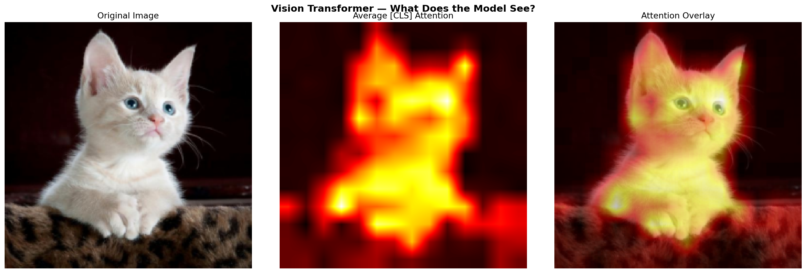

# 🧠 VLM-Transformers

**Building a Vision Language Model from scratch** — from raw pixels to natural language, one component at a time.

This project implements a complete Vision-Language Model (VLM) architecture using PyTorch, built step-by-step to deeply understand how modern multimodal AI systems work.

<p align="center">
  
  <br/>
  <em>Our custom ViT analyzing an image — attention heatmap shows where the model focuses</em>
</p>

---

## ✨ Features

- 🔧 **Custom Vision Transformer (ViT-Base)** — 86M parameters, built from scratch
- 🧩 **Patch Embedding** — Conv2d-based image-to-sequence conversion
- 🏷️ **[CLS] Token** — Learnable global image representation
- 🧠 **Multi-Head Self-Attention** — 12-head attention with visualization
- 🔍 **Attention Map Visualization** — See what the model focuses on
- 🚀 **AI Vision Assistant** — Gradio web app with captioning, VQA, and attention maps
- ⚡ **GPU Optimized** — Tested on NVIDIA RTX 3050 (15ms/image, 100 img/s)

---

## 🏗️ Architecture

```
📷 Input Image (224×224)
    │
    ▼
🧩 Patch Embedding (Conv2d)          → [B, 196, 768]
    │
    ▼
🏷️ + [CLS] Token                     → [B, 197, 768]
    │
    ▼
📍 + Positional Encoding              → [B, 197, 768]
    │
    ▼
🔁 Transformer Encoder ×12
    │  ├─ LayerNorm → Multi-Head Self-Attention (12 heads) → Residual
    │  └─ LayerNorm → MLP (768→3072→768, GELU) → Residual
    │
    ▼
📊 [CLS] Output                       → [B, 768]    ← Image summary
    │
    ▼
🔗 Projection Layer                   → (Coming soon)
    │
    ▼
💬 Language Decoder                   → (Coming soon)
```

**ViT-Base Configuration:**
| Parameter | Value |
|-----------|-------|
| Embedding Dimension | 768 |
| Attention Heads | 12 |
| Encoder Layers | 12 |
| MLP Ratio | 4× |
| Patch Size | 16×16 |
| Total Parameters | **85,798,656 (86M)** |

---

## 📁 Project Structure

```text
VLM-Transformers/
├── src/                          # Core source code
│   ├── models/
│   │   ├── patch_embedding.py    # Conv2d-based patch → embedding
│   │   └── vision_transformer.py # VisionInput, MHSA, MLP, Encoder, Full ViT
│   ├── data/
│   │   └── images/               # Sample images + generated attention maps
│   ├── utils/                    # Helper functions
│   └── training/                 # Training loops (coming soon)
├── scripts/
│   ├── vision_assistant.py       # 🚀 AI Vision Assistant (Gradio web app)
│   ├── test_vit_gpu.py           # GPU benchmark + attention visualization
│   └── check_gpu.py              # CUDA verification
├── notebooks/
│   └── processing_pipeline1.ipynb # Step-by-step ViT construction
├── configs/                       # Hyperparameter configs (coming soon)
├── tests/                         # Unit tests
├── .gitignore
├── requirements.txt
└── README.md
```

---

## 🚀 Quick Start

### 1. Setup Environment
```bash
conda create -n torch_env python=3.10
conda activate torch_env
conda install pytorch torchvision torchaudio pytorch-cuda=12.1 -c pytorch -c nvidia
pip install gradio transformers pillow seaborn ipykernel
```

### 2. Verify GPU
```bash
python scripts/check_gpu.py
```

### 3. Run GPU Benchmark
```bash
python scripts/test_vit_gpu.py
```
This runs the full ViT-Base on your GPU and generates attention map visualizations.

### 4. Launch AI Vision Assistant 🌐
```bash
python scripts/vision_assistant.py
```
Opens a web app at `http://localhost:7860` with:
- **📝 Image Captioning** — Describe any image
- **❓ Visual Q&A** — Ask questions about images
- **🔍 Attention Maps** — Visualize your custom ViT's focus

---

## ⚡ GPU Benchmarks (RTX 3050 6GB)

```
Model:        ViT-Base (86M params, 327 MB)
Device:       NVIDIA GeForce RTX 3050 6GB Laptop GPU

Single Image:  15.1 ms
Batch 1:       19.0 ms  |  52.6 img/s  | 370 MB VRAM
Batch 2:       30.4 ms  |  65.7 img/s  | 400 MB VRAM
Batch 4:       50.0 ms  |  79.9 img/s  | 454 MB VRAM
Batch 8:       79.8 ms  | 100.2 img/s  | 570 MB VRAM
```

---

## 📒 Learning Pipeline (Notebook)

The `notebooks/processing_pipeline1.ipynb` notebook walks through the ViT construction step-by-step:

| Step | Component | What You Learn |
|------|-----------|---------------|
| 1 | Image Loading | PIL, matplotlib, RGB images |
| 2 | Preprocessing | Resize, ToTensor, normalization |
| 3 | Manual Patching | `unfold`-based patch grid visualization |
| 4 | Patch Embedding | Conv2d as simultaneous patching + projection |
| 5 | Positional Encoding | Learnable position embeddings + similarity heatmap |
| 6 | [CLS] Token | Global image representation token |
| 7 | Multi-Head Attention | 12-head self-attention + attention maps |
| 8 | Encoder Block | Pre-Norm, residual connections, MLP |
| 9 | Full ViT | Stack of 12 blocks → [CLS] output |

---

## 🗺️ Roadmap

- [x] **Phase 1: Vision Transformer** — Complete ViT-Base from scratch
  - [x] Patch Embedding (Conv2d)
  - [x] [CLS] Token + Positional Encoding
  - [x] Multi-Head Self-Attention
  - [x] Transformer Encoder Block (Pre-Norm)
  - [x] Full ViT-Base (12 layers, 86M params)
  - [x] Attention Map Visualization
  - [x] GPU Benchmarking
- [x] **POC: AI Vision Assistant** — Gradio web app demo
- [ ] **Phase 2: Language Model**
  - [ ] Text Tokenizer
  - [ ] Text Embeddings + Causal Masking
  - [ ] Transformer Decoder (autoregressive)
- [ ] **Phase 3: Vision-Language Fusion**
  - [ ] Projection Layer (vision → language space)
  - [ ] Cross-Attention Mechanism
  - [ ] End-to-End VLM Assembly
- [ ] **Phase 4: Training**
  - [ ] Image-Caption Dataset (COCO Captions)
  - [ ] Training Loop + Loss Functions
  - [ ] Evaluation Metrics

---

## 🛠️ Tech Stack

| Component | Technology |
|-----------|-----------|
| Deep Learning | PyTorch 2.5.1 |
| GPU | NVIDIA RTX 3050 6GB (CUDA 12.1) |
| VLM Backbone | Custom ViT-Base + BLIP (pretrained) |
| Web UI | Gradio |
| Pretrained Models | HuggingFace Transformers |
| Notebooks | Jupyter / IPyKernel |

---

## 📚 References

- [An Image is Worth 16x16 Words](https://arxiv.org/abs/2010.11929) — Dosovitskiy et al., 2020
- [Attention Is All You Need](https://arxiv.org/abs/1706.03762) — Vaswani et al., 2017
- [BLIP: Bootstrapping Language-Image Pre-training](https://arxiv.org/abs/2201.12086) — Li et al., 2022

---

> **Note:** This project requires a CUDA-enabled GPU for efficient training and inference.

